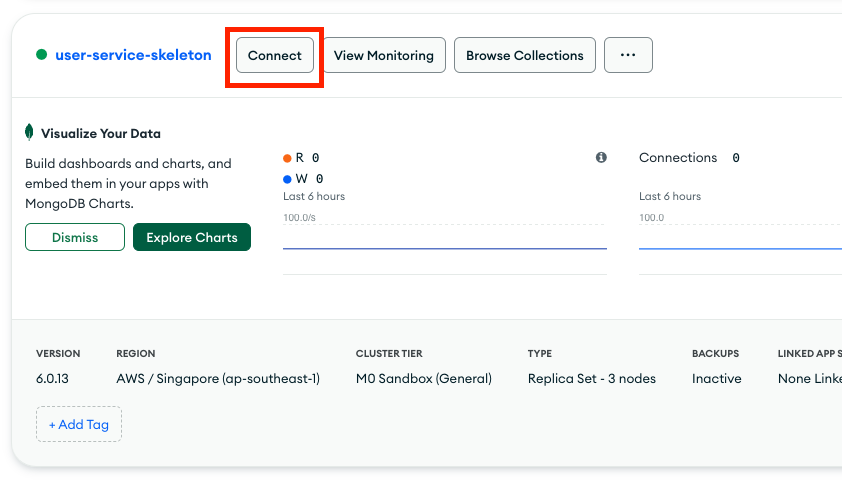
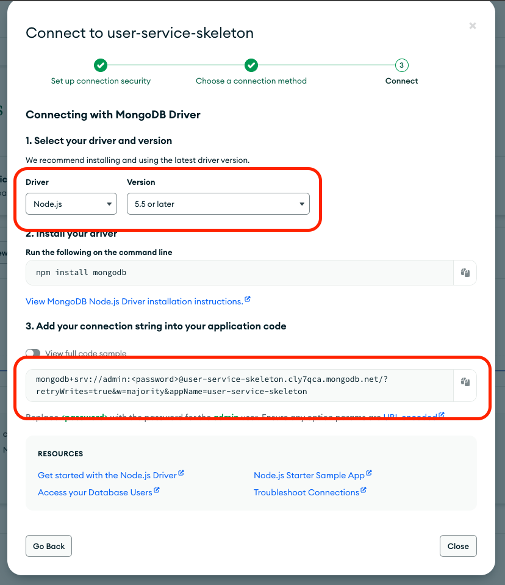

# Question Service Guide

## Setting-up

> :notebook: If you are familiar to MongoDB and wish to use a local instance, please feel free to do so. This guide utilizes MongoDB Cloud Services.

1. Set up a MongoDB Shared Cluster by following the steps in this [Guide](./MongoDBSetup.md).

2. After setting up, go to the Database Deployment Page. You would see a list of the Databases you have set up. Select `Connect` on the cluster you just created earlier on for User Service.

    

3. Select the `Drivers` option, as we have to link to a Node.js App (User Service).

    

4. Select `Node.js` in the `Driver` pull-down menu, and copy the connection string.

    Notice, you may see `<password>` in this connection string. We will be replacing this with the admin account password that we created earlier on when setting up the Shared Cluster.

    

5. In the `user-service` directory, create a copy of the `.env.sample` file and name it `.env`.

6. Update the `DB_CLOUD_URI` of the `.env` file, and paste the string we copied earlier in step 4. Also remember to replace the `<password>` placeholder with the actual password.
